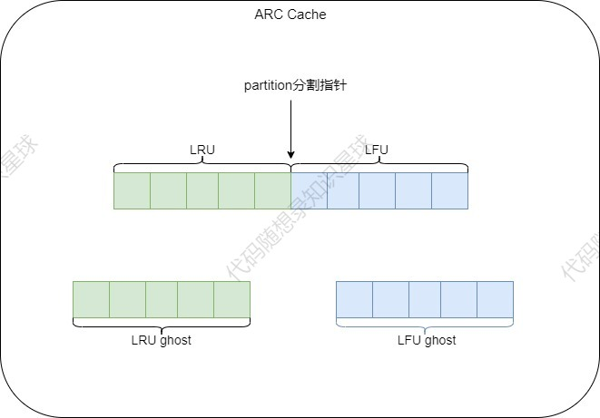

# 3.缓存淘汰策略

## 缓存淘汰策略

<font style="color:rgb(77, 77, 77);">常见的有FIFO、LRU、LFU、ARC等，下面我将为大家详细介绍以上四种缓存淘汰策略。ps：前三种缓存淘汰策略的基础版本我会简略带过，因为网上的资料很多且详细，</font>**<font style="color:rgb(77, 77, 77);">我重点讲一下LRU和LFU的待优化点</font>**<font style="color:rgb(77, 77, 77);">，最后一种缓存淘汰策略ARC我会详细介绍一下。</font>

> <font style="color:rgb(77, 77, 77);">缓存污染：指访问很少的数据在服务完访问请求后还继续留在缓存中，造成缓存空间的浪费。</font>
>
> <font style="color:rgb(77, 77, 77);">缓存污染一旦变严重后，有大量不再访问的数据滞留在缓存中，往缓存中写入新数据时需要先把数据淘汰出缓存，引入额外的时间开销。</font>

### FIFO

<font style="color:rgb(77, 77, 77);">先进先出算法，是最简单的页面替换策略，按照页面进入内存的顺序来决定替换哪个页面。即优先淘汰最早进入内存的页面，不论这些页面之后是否被频繁访问。但是FIFO可能会导致“Belady异常”，即</font><font style="color:rgb(77, 77, 77);">随着分配给进程的物理块数增加，缺页次数反而增加</font><font style="color:rgb(77, 77, 77);">。 </font>

### LRU

<font style="color:rgb(77, 77, 77);">最近最少使用算法，如果一个数据最近被访问过，那么将来被访问的可能性也较大。因此，它选择最近最长时间未被访问的页面进行替换。LRU的性能和效率接近OPT，但是对于频繁访问的页面更新开销较大。</font>

<font style="color:rgb(77, 77, 77);">潜在问题：</font><font style="color:rgb(77, 77, 77);">淘汰热点数据</font><font style="color:rgb(77, 77, 77);">，如果有个数据在1个小时的前59分钟访问了1万次(可见这是个热点数据),再后一分钟没有访问这个数据，但是有其他的数据访问，就导致了我们这个热点数据被淘汰。</font>

<font style="color:rgb(77, 77, 77);">推荐一篇学习LRU算法的文章：</font><https://blog.csdn.net/saxon_li/article/details/123974696>

**基础LRU代码**

```cpp
// 前向声明
template<typename Key, typename Value> class KLruCache;

template<typename Key, typename Value>
class LruNode 
{
private:
    Key key_;
    Value value_;
    size_t accessCount_;  // 访问次数
    std::weak_ptr<LruNode<Key, Value>> prev_;  // 改为weak_ptr打破循环引用
    std::shared_ptr<LruNode<Key, Value>> next_;

public:
    LruNode(Key key, Value value)
        : key_(key)
        , value_(value)
        , accessCount_(1) 
    {}

    // 提供必要的访问器
    Key getKey() const { return key_; }
    Value getValue() const { return value_; }
    void setValue(const Value& value) { value_ = value; }
    size_t getAccessCount() const { return accessCount_; }
    void incrementAccessCount() { ++accessCount_; }

    friend class KLruCache<Key, Value>;
};


template<typename Key, typename Value>
class KLruCache : public KICachePolicy<Key, Value>
{
public:
    using LruNodeType = LruNode<Key, Value>;
    using NodePtr = std::shared_ptr<LruNodeType>;
    using NodeMap = std::unordered_map<Key, NodePtr>;

    KLruCache(int capacity)
        : capacity_(capacity)
    {
        initializeList();
    }

    ~KLruCache() override = default;

    // 添加缓存
    void put(Key key, Value value) override
    {
        if (capacity_ <= 0)
            return;
    
        std::lock_guard<std::mutex> lock(mutex_);
        auto it = nodeMap_.find(key);
        if (it != nodeMap_.end())
        {
            // 如果在当前容器中,则更新value,并调用get方法，代表该数据刚被访问
            updateExistingNode(it->second, value);
            return ;
        }

        addNewNode(key, value);
    }

    bool get(Key key, Value& value) override
    {
        std::lock_guard<std::mutex> lock(mutex_);
        auto it = nodeMap_.find(key);
        if (it != nodeMap_.end())
        {
            moveToMostRecent(it->second);
            value = it->second->getValue();
            return true;
        }
        return false;
    }

    Value get(Key key) override
    {
        Value value{};
        // memset(&value, 0, sizeof(value));   // memset 是按字节设置内存的，对于复杂类型（如 string）使用 memset 可能会破坏对象的内部结构
        get(key, value);
        return value;
    }

    // 删除指定元素
    void remove(Key key) 
    {   
        std::lock_guard<std::mutex> lock(mutex_);
        auto it = nodeMap_.find(key);
        if (it != nodeMap_.end())
        {
            removeNode(it->second);
            nodeMap_.erase(it);
        }
    }

private:
    void initializeList()
    {
        // 创建首尾虚拟节点
        dummyHead_ = std::make_shared<LruNodeType>(Key(), Value());
        dummyTail_ = std::make_shared<LruNodeType>(Key(), Value());
        dummyHead_->next_ = dummyTail_;
        dummyTail_->prev_ = dummyHead_;
    }

    void updateExistingNode(NodePtr node, const Value& value) 
    {
        node->setValue(value);
        moveToMostRecent(node);
    }

    void addNewNode(const Key& key, const Value& value) 
    {
       if (nodeMap_.size() >= capacity_) 
       {
           evictLeastRecent();
       }

       NodePtr newNode = std::make_shared<LruNodeType>(key, value);
       insertNode(newNode);
       nodeMap_[key] = newNode;
    }

    // 将该节点移动到最新的位置
    void moveToMostRecent(NodePtr node) 
    {
        removeNode(node);
        insertNode(node);
    }

    void removeNode(NodePtr node) 
    {
        if(!node->prev_.expired() && node->next_) 
        {
            auto prev = node->prev_.lock(); // 使用lock()获取shared_ptr
            prev->next_ = node->next_;
            node->next_->prev_ = prev;
            node->next_ = nullptr; // 清空next_指针，彻底断开节点与链表的连接
        }
    }

    // 从尾部插入结点
    void insertNode(NodePtr node) 
    {
        node->next_ = dummyTail_;
        node->prev_ = dummyTail_->prev_;
        dummyTail_->prev_.lock()->next_ = node; // 使用lock()获取shared_ptr
        dummyTail_->prev_ = node;
    }

    // 驱逐最近最少访问
    void evictLeastRecent() 
    {
        NodePtr leastRecent = dummyHead_->next_;
        removeNode(leastRecent);
        nodeMap_.erase(leastRecent->getKey());
    }

private:
    int           capacity_; // 缓存容量
    NodeMap       nodeMap_; // key -> Node 
    std::mutex    mutex_;
    NodePtr       dummyHead_; // 虚拟头结点
    NodePtr       dummyTail_;
};
```

学习完基础的LRU缓存算法实现之后，大家不难发现他身上的缺点：

* 对访问模式不敏感：如果是循环的一次性遍历大量不重复的数据（如A->B->C->D->A->B->...），LRU可能逐步清空，几乎无法命中。
* 缓存污染：如果加载一些不再会被访问的冷数据（如一次性数据），将原有的热点数据挤出，冷数据留在缓存中，降低了缓存的利用率。
* 不适用于某些场景：在某些场景下，最近最少使用并不代表最不重要或最少需要。
* 锁的粒度大：多线程高并发的访问下，同步等待将是一笔极大的时间开销。

针对上述问题，可以本文进行了以下几点优化：

* LRU-k
* HashLRU

#### LRU-k

参考：<https://juejin.cn/post/6844904049263771662>

LRU-k算法是对LRU算法的改进，基础的LRU算法被访问数据进入缓存队列只需要访问(`put、get`)一次就行，但是现在需要被访问k（大小自定义）次才能被放入缓存中，基础的LRU算法可以看成是LRU-1。

LRU-k算法有两个队列一个是缓存队列，一个是数据访问历史队列。当访问一个数据时，首先将其添加进入访问历史队列并进行累加访问次数，当该数据的访问次数超过k次后，才将数据缓存到缓存队列，从而避免缓存队列被冷数据所污染。同时访问历史队列中的数据也不是一直保留的，也是需要按照LRU的规则进行淘汰的。LRU-k执行过程如图：


一般情况下，当k的值越大，缓存的命中率越高，但也使得缓存难以淘汰。综合来说，k = 2 时性能最优。

**LRU-k 代码实现**

```cpp
// LRU优化：Lru-k版本。 通过继承的方式进行再优化
template<typename Key, typename Value>
class KLruKCache : public KLruCache<Key, Value>
{
public:
    KLruKCache(int capacity, int historyCapacity, int k)
        : KLruCache<Key, Value>(capacity) // 调用基类构造
        , historyList_(std::make_unique<KLruCache<Key, size_t>>(historyCapacity))
        , k_(k)
    {}

    Value get(Key key) 
    {
        // 首先尝试从主缓存获取数据
        Value value{};
        bool inMainCache = KLruCache<Key, Value>::get(key, value);

        // 获取并更新访问历史计数
        size_t historyCount = historyList_->get(key);
        historyCount++;
        historyList_->put(key, historyCount);

        // 如果数据在主缓存中，直接返回
        if (inMainCache) 
        {
            return value;
        }

        // 如果数据不在主缓存，但访问次数达到了k次
        if (historyCount >= k_) 
        {
            // 检查是否有历史值记录
            auto it = historyValueMap_.find(key);
            if (it != historyValueMap_.end()) 
            {
                // 有历史值，将其添加到主缓存
                Value storedValue = it->second;
                
                // 从历史记录移除
                historyList_->remove(key);
                historyValueMap_.erase(it);
                
                // 添加到主缓存
                KLruCache<Key, Value>::put(key, storedValue);
                
                return storedValue;
            }
            // 没有历史值记录，无法添加到缓存，返回默认值
        }

        // 数据不在主缓存且不满足添加条件，返回默认值
        return value;
    }

    void put(Key key, Value value) 
    {
        // 检查是否已在主缓存
        Value existingValue{};
        bool inMainCache = KLruCache<Key, Value>::get(key, existingValue);
        
        if (inMainCache) 
        {
            // 已在主缓存，直接更新
            KLruCache<Key, Value>::put(key, value);
            return;
        }
        
        // 获取并更新访问历史
        size_t historyCount = historyList_->get(key);
        historyCount++;
        historyList_->put(key, historyCount);
        
        // 保存值到历史记录映射，供后续get操作使用
        historyValueMap_[key] = value;
        
        // 检查是否达到k次访问阈值
        if (historyCount >= k_) 
        {
            // 达到阈值，添加到主缓存
            historyList_->remove(key);
            historyValueMap_.erase(key);
            KLruCache<Key, Value>::put(key, value);
        }
    }

private:
    int                                     k_; // 进入缓存队列的评判标准
    std::unique_ptr<KLruCache<Key, size_t>> historyList_; // 访问数据历史记录(value为访问次数)
    std::unordered_map<Key, Value>          historyValueMap_; // 存储未达到k次访问的数据值
};
```

上述代码直接继承基础LRU。

#### HashLRU

参考：<https://github.com/songangweb/mcache/tree/master>

有一定开发经验的同学一定发现了，该项目中锁的粒度很大，并且这个锁的粒度还不好直接减少毕竟涉及线程安全的地方实在是太多了，甚至连使用读写锁都没办法优化。那我们只好换个思路，将lru分片。      具体实现结构如图：


根据传入的`key`值进行哈希运算后找到对应的`lru`分片，然后调用该分片相应的方法。

大家试想一下当多个线程同时访问一个LRU时（LFU同理），由于锁的粒度大，是不是会造成长时间的同步等待，那如果是多个线程同时访问多个LRU缓存呢，是不是同步等待时间大大减少了。

**普通的**<code>**lruCache**</code>**和**<code>**lfuCache**</code>**在高并发情况下耗时增加的原因分析：**

线程安全的lfuCache中有锁的存在。每次读写操作之前都有加锁操作，完成读写操作之后还有解锁操作。在低QPS下，锁的竞争的耗时基本可以忽略；但在高并发的情况下，大量的时间消耗在等待锁的操作上，导致耗时增长。

<code>**HashLruCache**</code>**和**<code>**HashLfuCache**</code>**适应高并发场景：**

针对大量同步等待操作导致耗时增加的情况，解决方案就是尽量减小临界区。引入`hash`机制，对全量数据做分片处理，在原有`LfuCache`的基础上形成`HashLfuCache`，以降低查询耗时。

`HashLfuCache`引入哈希算法，将缓存数据分散到N个`LfuCache`上，查询时也按照相同的哈希算法，先获取数据可能存在的分片，然后再去对应的分片上查询数据。这样可以增加lfu的读写操作的并行度，减少同步等待的耗时。

`HashLru`代码实现：

```cpp
// lru优化：对lru进行分片，提高高并发使用的性能
template<typename Key, typename Value>
class KHashLruCaches
{
public:
    KHashLruCaches(size_t capacity, int sliceNum)
        : capacity_(capacity)
        , sliceNum_(sliceNum > 0 ? sliceNum : std::thread::hardware_concurrency())
    {
        size_t sliceSize = std::ceil(capacity / static_cast<double>(sliceNum_)); // 获取每个分片的大小
        for (int i = 0; i < sliceNum_; ++i)
        {
            lruSliceCaches_.emplace_back(new KLruCache<Key, Value>(sliceSize)); 
        }
    }

    void put(Key key, Value value)
    {
        // 获取key的hash值，并计算出对应的分片索引
        size_t sliceIndex = Hash(key) % sliceNum_;
        lruSliceCaches_[sliceIndex]->put(key, value);
    }

    bool get(Key key, Value& value)
    {
        // 获取key的hash值，并计算出对应的分片索引
        size_t sliceIndex = Hash(key) % sliceNum_;
        return lruSliceCaches_[sliceIndex]->get(key, value);
    }

    Value get(Key key)
    {
        Value value;
        memset(&value, 0, sizeof(value));
        get(key, value);
        return value;
    }

private:
    // 将key转换为对应hash值
    size_t Hash(Key key)
    {
        std::hash<Key> hashFunc;
        return hashFunc(key);
    }

private:
    size_t                                              capacity_;  // 总容量
    int                                                 sliceNum_;  // 切片数量
    std::vector<std::unique_ptr<KLruCache<Key, Value>>> lruSliceCaches_; // 切片LRU缓存
};
```

`HashLruCaches`和`KLruCache`类是组合关系，前者依赖于后者，`KLruCache`类的实现就在上文中。

注意：`LRU(LFU)`分片之后淘汰的元素就不是全局中访问最近最不经常访问的元素了(全局的`minFreq_`)，淘汰的就是局部`minFreq_`，这里是可以接受的，因为可能某个分片LRU(LFU)中存着大量元素，下一个元素还分给这个`LRU(LFU)`分片的话，就应该将当前的`LRU(LFU)`中最近最不经常访问的元素剔除而不是全局的最近最不经常访问元素，然后将新元素添加进来。

### LFU

<font style="color:rgb(25, 27, 31);">最近使用频率高的数据很大概率将会再次被使用,而最近使用频率低的数据,将来大概率不会再使用。</font>

<font style="color:rgb(25, 27, 31);">做法：把使用频率最小的数据置换出去。这种算法更多是从使用频率的角度（但是当缓存满时，如果最低访问频次的缓存数据有多个，就需要考虑哪个元素最近最久未被访问）去考虑的。</font>

<font style="color:rgb(25, 27, 31);">附上一篇学习LFU的好文：</font><https://blog.csdn.net/saxon_li/article/details/123985667>

学完基础的LFU，大家不难发现其身上还有很多待优化点：

* 频率爆炸问题：对于长期驻留在缓存中的热数据，频率计数可能会无限增长，占用额外的存储空间或导致计数溢出。
* 过时热点数据占用缓存：一些数据可能已经不再是热点数据，但因访问频率过高，难以被替换。
* 冷启动问题：刚加入缓存的项可能因为频率为1而很快被淘汰，即便这些项是近期访问的热门数据。
* 不适合短期热点：LFU对长期热点数据表现较好，但对短期热点数据响应较慢，可能导致短期热点数据无法及时缓存。
* 缺乏动态适应性：固定的LFU策略难以适应不同的应用场景或工作负载。
* 锁的粒度大，多线程高并发访问下锁的同步等待时间过长。

针对上述问题，文本进行了以下几点优化：

* 加上最大平均访问次数限制
* HashLFUCache

#### 最大平均访问次数限制

参考：<https://blog.csdn.net/yunshuipiao123/article/details/98958750>

在LFU算法之上，引入访问次数平均值概念，当平均值大于最大平均值限制时将所有结点的访问次数减去最大平均值限制的一半或者一个固定值。相当于热点数据“老化”了，这样可以避免频次计数溢出，也可以缓解缓存污染。

**加上最大平均访问次数限制的LFU代码**

```cpp
template<typename Key, typename Value> class KLfuCache;

template<typename Key, typename Value>
class FreqList
{
private:
    struct Node
    {
        int freq; // 访问频次
        Key key;
        Value value;
        std::weak_ptr<Node> pre; // 上一结点改为weak_ptr打破循环引用
        std::shared_ptr<Node> next;

        Node() 
        : freq(1), next(nullptr) {}
        Node(Key key, Value value) 
        : freq(1), key(key), value(value), next(nullptr) {}
    };

    using NodePtr = std::shared_ptr<Node>;
    int freq_; // 访问频率
    NodePtr head_; // 假头结点
    NodePtr tail_; // 假尾结点

public:
    explicit FreqList(int n) 
     : freq_(n) 
    {
      head_ = std::make_shared<Node>();
      tail_ = std::make_shared<Node>();
      head_->next = tail_;
      tail_->pre = head_;
    }

    bool isEmpty() const
    {
      return head_->next == tail_;
    }

    // 提那家结点管理方法
    void addNode(NodePtr node) 
    {
        if (!node || !head_ || !tail_) 
            return;

        node->pre = tail_->pre;
        node->next = tail_;
        tail_->pre.lock()->next = node; // 使用lock()获取shared_ptr
        tail_->pre = node;
    }

    void removeNode(NodePtr node)
    {
        if (!node || !head_ || !tail_)
            return;
        if (node->pre.expired() || !node->next) 
            return;

        auto pre = node->pre.lock(); // 使用lock()获取shared_ptr
        pre->next = node->next;
        node->next->pre = pre;
        node->next = nullptr; // 确保显式置空next指针，彻底断开节点与链表的连接
    }

    NodePtr getFirstNode() const { return head_->next; }
    
    friend class KLfuCache<Key, Value>;
};

template <typename Key, typename Value>
class KLfuCache : public KICachePolicy<Key, Value>
{
public:
    using Node = typename FreqList<Key, Value>::Node;
    using NodePtr = std::shared_ptr<Node>;
    using NodeMap = std::unordered_map<Key, NodePtr>;

    KLfuCache(int capacity, int maxAverageNum = 10)
    : capacity_(capacity), minFreq_(INT8_MAX), maxAverageNum_(maxAverageNum),
      curAverageNum_(0), curTotalNum_(0) 
    {}

    ~KLfuCache() override = default;

    void put(Key key, Value value) override
    {
        if (capacity_ == 0)
            return;

        std::lock_guard<std::mutex> lock(mutex_);
        auto it = nodeMap_.find(key);
        if (it != nodeMap_.end())
        {
            // 重置其value值
            it->second->value = value;
            // 找到了直接调整就好了，不用再去get中再找一遍，但其实影响不大
            getInternal(it->second, value);
            return;
        }

        putInternal(key, value);
    }

    // value值为传出参数
    bool get(Key key, Value& value) override
    {
      std::lock_guard<std::mutex> lock(mutex_);
      auto it = nodeMap_.find(key);
      if (it != nodeMap_.end())
      {
          getInternal(it->second, value);
          return true;
      }

      return false;
    }

    Value get(Key key) override
    {
      Value value;
      get(key, value);
      return value;
    }

      // 清空缓存,回收资源
    void purge()
    {
      nodeMap_.clear();
      freqToFreqList_.clear();
    }

private:
    void putInternal(Key key, Value value); // 添加缓存
    void getInternal(NodePtr node, Value& value); // 获取缓存

    void kickOut(); // 移除缓存中的过期数据

    void removeFromFreqList(NodePtr node); // 从频率列表中移除节点
    void addToFreqList(NodePtr node); // 添加到频率列表

    void addFreqNum(); // 增加平均访问等频率
    void decreaseFreqNum(int num); // 减少平均访问等频率
    void handleOverMaxAverageNum(); // 处理当前平均访问频率超过上限的情况
    void updateMinFreq();

private:
    int                                            capacity_; // 缓存容量
    int                                            minFreq_; // 最小访问频次(用于找到最小访问频次结点)
    int                                            maxAverageNum_; // 最大平均访问频次
    int                                            curAverageNum_; // 当前平均访问频次
    int                                            curTotalNum_; // 当前访问所有缓存次数总数 
    std::mutex                                     mutex_; // 互斥锁
    NodeMap                                        nodeMap_; // key 到 缓存节点的映射
    std::unordered_map<int, FreqList<Key, Value>*> freqToFreqList_;// 访问频次到该频次链表的映射
};

template<typename Key, typename Value>
void KLfuCache<Key, Value>::getInternal(NodePtr node, Value& value)
{
    // 找到之后需要将其从低访问频次的链表中删除，并且添加到+1的访问频次链表中，
    // 访问频次+1, 然后把value值返回
    value = node->value;
    // 从原有访问频次的链表中删除节点
    removeFromFreqList(node); 
    node->freq++;
    addToFreqList(node);
    // 如果当前node的访问频次如果等于minFreq+1，并且其前驱链表为空，则说明
    // freqToFreqList_[node->freq - 1]链表因node的迁移已经空了，需要更新最小访问频次
    if (node->freq - 1 == minFreq_ && freqToFreqList_[node->freq - 1]->isEmpty())
        minFreq_++;

    // 总访问频次和当前平均访问频次都随之增加
    addFreqNum();
}

template<typename Key, typename Value>
void KLfuCache<Key, Value>::putInternal(Key key, Value value)
{   
    // 如果不在缓存中，则需要判断缓存是否已满
    if (nodeMap_.size() == capacity_)
    {
        // 缓存已满，删除最不常访问的结点，更新当前平均访问频次和总访问频次
        kickOut();
    }
    
    // 创建新结点，将新结点添加进入，更新最小访问频次
    NodePtr node = std::make_shared<Node>(key, value);
    nodeMap_[key] = node;
    addToFreqList(node);
    addFreqNum();
    minFreq_ = std::min(minFreq_, 1);
}

template<typename Key, typename Value>
void KLfuCache<Key, Value>::kickOut()
{
    NodePtr node = freqToFreqList_[minFreq_]->getFirstNode();
    removeFromFreqList(node);
    nodeMap_.erase(node->key);
    decreaseFreqNum(node->freq);
}

template<typename Key, typename Value>
void KLfuCache<Key, Value>::removeFromFreqList(NodePtr node)
{
    // 检查结点是否为空
    if (!node) 
        return;
    
    auto freq = node->freq;
    freqToFreqList_[freq]->removeNode(node);
}

template<typename Key, typename Value>
void KLfuCache<Key, Value>::addToFreqList(NodePtr node)
{
    // 检查结点是否为空
    if (!node) 
        return;

    // 添加进入相应的频次链表前需要判断该频次链表是否存在
    auto freq = node->freq;
    if (freqToFreqList_.find(node->freq) == freqToFreqList_.end())
    {
        // 不存在则创建
        freqToFreqList_[node->freq] = new FreqList<Key, Value>(node->freq);
    }

    freqToFreqList_[freq]->addNode(node);
}

template<typename Key, typename Value>
void KLfuCache<Key, Value>::addFreqNum()
{
    curTotalNum_++;
    if (nodeMap_.empty())
        curAverageNum_ = 0;
    else
        curAverageNum_ = curTotalNum_ / nodeMap_.size();

    if (curAverageNum_ > maxAverageNum_)
    {
       handleOverMaxAverageNum();
    }
}

template<typename Key, typename Value>
void KLfuCache<Key, Value>::decreaseFreqNum(int num)
{
    // 减少平均访问频次和总访问频次
    curTotalNum_ -= num;
    if (nodeMap_.empty())
        curAverageNum_ = 0;
    else
        curAverageNum_ = curTotalNum_ / nodeMap_.size();
}

template<typename Key, typename Value>
void KLfuCache<Key, Value>::handleOverMaxAverageNum()
{
    if (nodeMap_.empty())
        return;

    // 当前平均访问频次已经超过了最大平均访问频次，所有结点的访问频次- (maxAverageNum_ / 2)
    for (auto it = nodeMap_.begin(); it != nodeMap_.end(); ++it)
    {
        // 检查结点是否为空
        if (!it->second)
            continue;

        NodePtr node = it->second;

        // 先从当前频率列表中移除
        removeFromFreqList(node);

        // 减少频率
        node->freq -= maxAverageNum_ / 2;
        if (node->freq < 1) node->freq = 1;

        // 添加到新的频率列表
        addToFreqList(node);
    }

    // 更新最小频率
    updateMinFreq();
}

template<typename Key, typename Value>
void KLfuCache<Key, Value>::updateMinFreq() 
{
    minFreq_ = INT8_MAX;
    for (const auto& pair : freqToFreqList_) 
    {
        if (pair.second && !pair.second->isEmpty()) 
        {
            minFreq_ = std::min(minFreq_, pair.first);
        }
    }
    if (minFreq_ == INT8_MAX) 
        minFreq_ = 1;
}
```

#### 设置最大平均访问次数的值解决了什么问题？

1. 防止某一个缓存的访问频次无限增加，而导致的计数溢出。
2. 旧的热点缓存，也就是该数据之前的访问频次很高，但是现在不再被访问了，也能够保证他在每次访问缓存平均访问次数大于最大平均访问次数的时候减去一个固定的值，使这个过去的热点缓存的访问频次逐步降到最低，然后从内存中淘汰出去
3. 一定程度上是对新加入进来的缓存，也就是访问频次为1的数据缓存进行了保护，因为长时间没被访问的旧的数据不再会长期占据缓存空间，访问频率会逐步被降为小于1最终淘汰。

#### HashLfuCache

实现类似于HashLruCache，理论部分直接看上文，代码实现如下：

```cpp
// 并没有牺牲空间换时间，他是把原有缓存大小进行了分片。
template<typename Key, typename Value>
class KHashLfuCache
{
public:
    KHashLfuCache(size_t capacity, int sliceNum, int maxAverageNum = 10)
        : sliceNum_(sliceNum > 0 ? sliceNum : std::thread::hardware_concurrency())
        , capacity_(capacity)
    {
        size_t sliceSize = std::ceil(capacity_ / static_cast<double>(sliceNum_)); // 每个lfu分片的容量
        for (int i = 0; i < sliceNum_; ++i)
        {
            lfuSliceCaches_.emplace_back(new KLfuCache<Key, Value>(sliceSize, maxAverageNum));
        }
    }

    void put(Key key, Value value)
    {
        // 根据key找出对应的lfu分片
        size_t sliceIndex = Hash(key) % sliceNum_;
        lfuSliceCaches_[sliceIndex]->put(key, value);
    }

    bool get(Key key, Value& value)
    {
        // 根据key找出对应的lfu分片
        size_t sliceIndex = Hash(key) % sliceNum_;
        return lfuSliceCaches_[sliceIndex]->get(key, value);
    }

    Value get(Key key)
    {
        Value value;
        get(key, value);
        return value;
    }

    // 清除缓存
    void purge()
    {
        for (auto& lfuSliceCache : lfuSliceCaches_)
        {
            lfuSliceCache->purge();
        }
    }

private:
    // 将key计算成对应哈希值
    size_t Hash(Key key)
    {
        std::hash<Key> hashFunc;
        return hashFunc(key);
    }

private:
    size_t capacity_; // 缓存总容量
    int sliceNum_; // 缓存分片数量
    std::vector<std::unique_ptr<KLfuCache<Key, Value>>> lfuSliceCaches_; // 缓存lfu分片容器
};
```

### ARC

核心思想：当访问的数据趋向于访问最近的内容，会更多地命中LRU list，这样会增大LRU的空间；当系统趋向于访问频繁访问的内容时，会更多地命中LFU list，这样会增加LFU的空间。

应用场景：主要应用于不同的访问模式(比如近期频繁访问和周期性访问交叉的场景)之间表现较好，因为他可以动态调整缓存分区的大小。

参考文章：

<https://blog.csdn.net/liuyun2113/article/details/12705057>

<https://blog.csdn.net/sbsbsb666666/article/details/130198264>

下面引入一些其他地方对其的解释：ps: MFU代表LFU，MRU代表LRU


相比于LFU和LRU其的优势在于：


#### 执行过程剖析：

1. 整个Cache分为两部分，LRU和LFU各占一半，根据不同的访问模式动态适应调整`partition`分割指针的位置（也就是动态调整lfu和lru的大小），除此之外，LRU和LFU各自有一个`ghost list`（淘汰链表，分别用于存储从LRU和LFU中淘汰的数据）。总体结构如图：



更加详细结构流程图如下：（ps：`ARCCache`对象的`get`方法和`put`方法实际上调用的是LRU和LFU的`get`与`put`方法。 `frequency`指的是该数据的访问频率。）


2. 在缓存中查找客户端需要访问的数据，如果没有命中，表示缓存穿透，将需要访问的数据从从磁盘中取出，插入缓存中的`LRU`部分对应链表的尾部（ps：头插和尾插没有区别，看个人习惯）。
3. 如果命中（LRU部分存在该数据）且LFU链表中没有则判断该数据的访问次数是否大于`transformTime_`（自定义的变量，我这里设置为3，代表访问次数超过3次），若大于则将该数据插入`LFU`对应链表中（一个块至少需要读取`transformTime_`次，并且要是最近请求的数据，才会被存储到`LFU`中）。于是，该数据块不仅仅只保存在LRU的缓存目录中，也将保存到LFU中。如果命中且LFU链表中存在，则将数据重新放入LFU链表中对应位置（访问频次计数+1），这样，那些真正被频繁访问的页面将一直呆在缓存中，不会被冷数据的加入而误淘汰，不经常访问的数据会向链表头部移动，最终被淘汰出去。
4. 如果此时`LRU`缓存满了，则从`LRU`链表中淘汰表头部的数据，将淘汰数据的`key`放入`LRU`对应的`ghost list`。然后在`LRU`的链表尾部添加新数据。如果`ghost list`的元素满了，按照先进先出的方式淘汰`ghost list`中的元素头部元素，然后再从尾部插入元素。
5. 如未命中缓存的数据根据key发现在LRU对应的`ghost list`中，则表示幽灵命中，缓存系统就可以知道，这是一个刚刚淘汰的页面，而不是第一次读取或者说很久之前读取的一个页面。于是根据这个信息来调整内部的`partition`分割指针以适应当下的访问模式。上述迹象说明当前的`LRU`缓存太小了，于是将`partition`分割指针右移一位(也就是`LRU`缓存空间+1，`LFU`缓存空间-1），并将命中的`key`数据从`ghost`的中移除，将新数据从LRU链表尾部插入。
6. 反之如果未命中缓存的数据根据key发现在LFU对应的ghost中，则说明当前访问模式偏向于频繁访问经常被访问的那一些数据，说明当下LFU缓存空间太小了，对应`partition`分割指针左移一位，并将命中的`key`数据从`ghost`的中移除，将新数据从LRU链表尾部插入。

#### ARC代码实现

该代码量较大，就不在文章中展示了，请移步：<https://github.com/youngyangyang04/KamaCache/blob/main/KArcCache.h>


> 更新: 2025-09-04 18:42:25  
> 原文: <https://www.yuque.com/chengxuyuancarl/ctp2tl/xr8cyqyb18wh1db0>